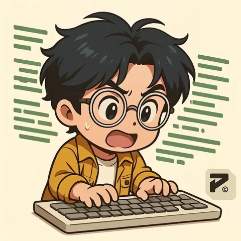

<div align="center">
  <!-- Profile Pic: Tag added for later link -->
  
</div>


## Hi!👋 I'm Shashi  


**👨‍💻 Final-year BCA student | 💻 C, C++, Java, HTML, CSS | 🤖 Learning AI/ML | 🌟 Aspiring Software Engineer | ✨ Love to build, learn & grow through code. | Tech Enthusiast**

---

## **☕ About me**
<a href="https://github.com/codershashi0001">
  </a> &nbsp;        
  I'm a final-year <b>BCA student at G.L. Bajaj Institute of Management</b>, passionate about building efficient and user-&nbsp;&nbsp;friendly software solutions.  
I enjoy exploring <b>C, C++, Java, HTML, CSS</b>, and <b>Git/GitHub</b>, with a growing interest in <br>&nbsp;&nbsp;<b>AI & Machine Learning</b>.  

&nbsp;&nbsp;I’m continuously improving my problem-solving skills and learning to design intuitive user interfaces through <br> &nbsp;&nbsp;**UI/UX fundamentals**.


## **🧠 Skills & Tools**  
<a href="https://github.com/codershashi0001">
  
</a>    

- 💻 **Languages:** C, C++, Java  
- 🌐 **Web Technologies:** HTML, CSS  
- 🧩 **Version Control:** Git, GitHub  
- 🎨 **Design:** Basic UI/UX  
- 🤖 **Learning:** Artificial Intelligence & Machine Learning

     
   
  
   


## **🧑‍💼 Strengths**  
- Strong **leadership** and **team management** qualities  
- Excellent **communication** and **adaptability**  
- Self-motivated, consistent, and goal-oriented  


## **🎨 Hobbies**  
- ✏️ **Drawing** – I like to draw when I’m free or need a creative break.  
- 🌍 **Travelling** – I enjoy exploring new places and cultures whenever I get the chance.  


## **📊 Github Stats**

<p align="center">
  
  
</p>

<p align="center">
  
</p>


<div align="center">
 <p align="center">

  <!-- [](https://git.io/streak-stats) -->
 [](https://git.io/streak-stats)


</p>

</div>


## **🧋 Special Widgets & Counters**

<!-- <p align="center"> -->
  <a href="https://github.com/codershashi0001"></a>      


  

```yaml
People who visit my profile :.

Hehe~ another QT has been caught.
```


<!-- </p>   -->
<br>

---

<!-- # 👋 Hi, I'm Shashi  
**Aspiring Software Engineer | BCA Student | Tech Enthusiast**

---

## 🚀 About Me  
I'm a final-year **BCA student at G.L. Bajaj Institute of Management**, passionate about building efficient and user-friendly software solutions.  
I enjoy exploring **C, C++, Java, HTML, CSS**, and **Git/GitHub**, with a growing interest in **AI & Machine Learning**.  

I’m continuously improving my problem-solving skills and learning to design intuitive user interfaces through **UI/UX fundamentals**.

---

## 🎯 Goals  
To become a skilled **Software Engineer** and contribute to meaningful, real-world projects that combine creativity, logic, and innovation.

---

## 🧠 Skills & Tools  
- 💻 **Languages:** C, C++, Java  
- 🌐 **Web Technologies:** HTML, CSS  
- 🧩 **Version Control:** Git, GitHub  
- 🎨 **Design:** Basic UI/UX  
- 🤖 **Learning:** Artificial Intelligence & Machine Learning  

---

## 🧑‍💼 Strengths  
- Strong **leadership** and **team management** qualities  
- Excellent **communication** and **adaptability**  
- Self-motivated, consistent, and goal-oriented  

---

## 🎨 Hobbies  
- ✏️ **Drawing** – I like to draw when I’m free or need a creative break.  
- 🌍 **Travelling** – I enjoy exploring new places and cultures whenever I get the chance.  

---

> _“Stay motivated, stay consistent — the journey matters more than the destination.”_

---
-->

## **📫 Connect** 
<a href="https://github.com/codershashi0001">
   </a>
 
**Please Contact me on linked in for a quick response:** [
Shashi Kumar](https://www.linkedin.com/in/shashi-kumar001?utm_source=share&utm_campaign=share_via&utm_content=profile&utm_medium=android_app)  
**You can also email me here:** shashi725806@gmail.com
  <br>


<p align="center">
  <!-- Social Media Icons without links, you can add your links later -->

[](https://github.com/codershashi0001)
 [](https://www.linkedin.com/in/shashi-kumar001?utm_source=share&utm_campaign=share_via&utm_content=profile&utm_medium=android_app)
[](mailto:shashi725806@gmail.com)
<!-- []() --> 


